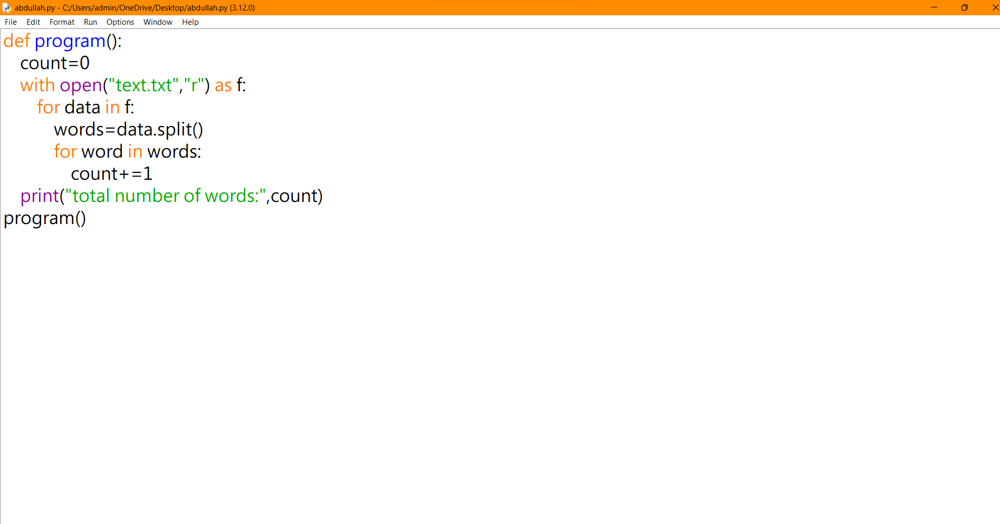
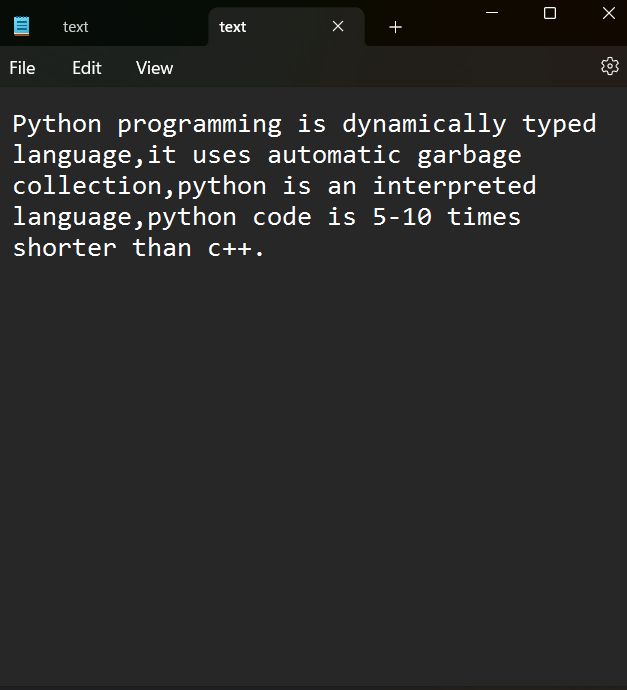
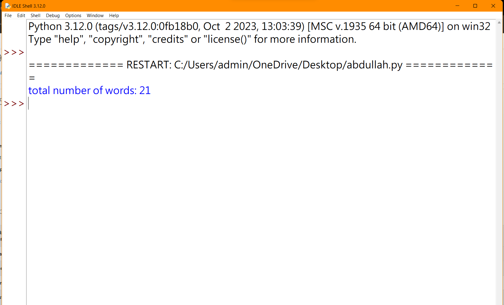

# Word-count
## AIM:
To write a python program for getting the word count from a text.
## EQUIPEMENT'S REQUIRED: 
PC
Anaconda - Python 3.7
## ALGORITHM: 
 ### Step 1:
To write a python program for getting the word count from a text file

### Step 2:
Open the required file by using the function "with".

### Step 3:
Then use the laptop to assign the i value in the file.

### Step 4:
Using split function to spilt the words

### Step 5:
Finding the given length of the words by using len() fuction.

### Step 6:
Calling the function and Printing the number of words.

## PROGRAM:
```py
#Program to find the word count.
#Developed by: HarishKumar R
#RegisterNumber: 23013540
def program():
    count=0
    with open("text.txt","r") as f:
        for data in f:
            words=data.split()
            for word in words:
                count+=1
    print("total number of words:",count)
program()
```

### OUTPUT:







## RESULT:
Thus the program is written to find the word count from a text.
